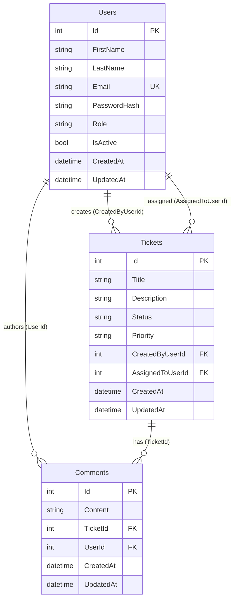

# Implementation Plan

**Project:** Support Ticket Management System  
**Stack:** ASP.NET Core 8 · EF Core 8 · SQL Server  
**Approach:** Clean Architecture · Iterative delivery · AI-assisted development

---

## 1. Architecture

### 1.1 Layered Design

The system follows **Clean Architecture** with four projects and a strict inward dependency rule.

```
┌─────────────────────────────────────────────────────────┐
│                    API Layer                            │
│  Controllers · Middleware · Swagger · Startup         │
└────────────────────────┬────────────────────────────────┘
                         │
┌────────────────────────▼────────────────────────────────┐
│              Infrastructure Layer                       │
│  EF Core · Repositories · Migrations · Seed Data        │
└────────────────────────┬────────────────────────────────┘
                         │
┌────────────────────────▼────────────────────────────────┐
│              Application Layer                          │
│  Services · DTOs · Validators · Interfaces · Mapping    │
└────────────────────────┬────────────────────────────────┘
                         │
┌────────────────────────▼────────────────────────────────┐
│                 Domain Layer                            │
│  Entities · Enums · Workflow Rules · Exceptions         │
└─────────────────────────────────────────────────────────┘
```

### 1.2 Project Structure

| Project | Responsibility |
|---------|----------------|
| `SupportTicketManagementSystem.Domain` | Core business entities, enums, `TicketStatusWorkflow`, domain exceptions |
| `SupportTicketManagementSystem.Application` | Use cases, DTOs, FluentValidation, AutoMapper, repository/service contracts |
| `SupportTicketManagementSystem.Infrastructure` | `ApplicationDbContext`, EF configurations, repository implementations, migrations |
| `SupportTicketManagementSystem.API` | HTTP endpoints, global exception handling, Swagger, DI composition |

### 1.3 Key Patterns

| Pattern | Application |
|---------|-------------|
| **Repository** | Entity-specific interfaces (`ITicketRepository`, `ICommentRepository`, `IUserRepository`) |
| **Unit of Work** | `IUnitOfWork` coordinates `SaveChangesAsync` across repositories |
| **Service layer** | `TicketService`, `CommentService` orchestrate validation, mapping, and persistence |
| **DTO + AutoMapper** | API contracts decoupled from domain entities |
| **FluentValidation** | Request and cross-field validation before service execution |
| **Global exception middleware** | Maps exceptions to `ApiErrorResponse` with correct HTTP status codes |
| **Dependency Injection** | `AddApplication()` and `AddInfrastructure()` extension methods |

### 1.4 Request Pipeline

```
HTTP Request
    → Model binding / ApiBehavior (400 on invalid input)
    → Controller
    → Service (validation → business logic → repository)
    → Unit of Work (SaveChanges)
    → ApiResponse<T> (success) or Exception → Middleware → ApiErrorResponse
```

---

## 2. Milestones

Development was delivered in **nine incremental milestones**, each building on the previous and verified with `dotnet build`.

| # | Milestone | Deliverables | Status |
|---|-----------|--------------|--------|
| M1 | **Solution scaffolding** | Four-project solution, DI wiring, repository/UoW skeleton, global exception middleware, Swagger stub | ✅ Complete |
| M2 | **Domain & database** | `User`, `Ticket`, `Comment` entities; enums; EF configurations; `InitialCreate` migration | ✅ Complete |
| M3 | **Ticket CRUD** | DTOs, `TicketRepository`, `TicketService`, `TicketsController`, validators, AutoMapper | ✅ Complete |
| M4 | **Comments** | Comment APIs, ticket-existence validation, ordered retrieval | ✅ Complete |
| M5 | **Status workflow** | `TicketStatusWorkflow`, transition validation, rejection of invalid changes | ✅ Complete |
| M6 | **Search & pagination** | Keyword search, status filter, `PagedResult<T>`, query validation | ✅ Complete |
| M7 | **Cross-cutting quality** | FluentValidation expansion, consistent error responses, Swagger XML/examples, EF tooling | ✅ Complete |
| M8 | **Testing & seed data** | Integration tests (14 scenarios), idempotent runtime seeder | ✅ Complete |
| M9 | **Review & hardening** | Architecture refactor, bug/edge-case fixes, documentation (`README`, analysis docs) | ✅ Complete |

### Post-v1 Roadmap (Planned)

| Milestone | Scope |
|-----------|-------|
| M10 | JWT authentication and role-based authorization |
| M11 | Comment pagination and rate limiting |
| M12 | Health checks, logging enrichment, AutoMapper security upgrade |

---

## 3. Database Design

### 3.1 Entity-Relationship Diagram



### 3.2 Table Definitions

#### Users

| Column | Type | Constraints |
|--------|------|-------------|
| `Id` | `int` | PK, identity |
| `FirstName` | `nvarchar(100)` | NOT NULL |
| `LastName` | `nvarchar(100)` | NOT NULL |
| `Email` | `nvarchar(256)` | NOT NULL, unique index |
| `PasswordHash` | `nvarchar(512)` | NULL (reserved for future auth) |
| `Role` | `nvarchar(50)` | NOT NULL (`Admin`, `Agent`, `Customer`) |
| `IsActive` | `bit` | NOT NULL, default `true` |
| `CreatedAt` | `datetime2` | NOT NULL |
| `UpdatedAt` | `datetime2` | NULL |

#### Tickets

| Column | Type | Constraints |
|--------|------|-------------|
| `Id` | `int` | PK, identity |
| `Title` | `nvarchar(200)` | NOT NULL |
| `Description` | `nvarchar(4000)` | NOT NULL |
| `Status` | `nvarchar(50)` | NOT NULL, indexed |
| `Priority` | `nvarchar(50)` | NOT NULL, indexed |
| `CreatedByUserId` | `int` | FK → Users, NOT NULL, indexed, **Restrict** on delete |
| `AssignedToUserId` | `int` | FK → Users, NULL, indexed, **SetNull** on delete |
| `CreatedAt` | `datetime2` | NOT NULL |
| `UpdatedAt` | `datetime2` | NULL |

#### Comments

| Column | Type | Constraints |
|--------|------|-------------|
| `Id` | `int` | PK, identity |
| `Content` | `nvarchar(2000)` | NOT NULL |
| `TicketId` | `int` | FK → Tickets, NOT NULL, indexed, **Cascade** on delete |
| `UserId` | `int` | FK → Users, NOT NULL, indexed, **Restrict** on delete |
| `CreatedAt` | `datetime2` | NOT NULL |
| `UpdatedAt` | `datetime2` | NULL |

### 3.3 Migration Strategy

| Migration | Purpose |
|-----------|---------|
| `InitialCreate` | Creates `Users`, `Tickets`, `Comments` tables with indexes and FKs |
| `MoveSeedToRuntimeSeeder` | Schema snapshot update; seed data moved to runtime seeder |

**Runtime behavior:**
- **Development** — Auto-migrate on startup + idempotent seed
- **Testing** — `EnsureCreated` + seed (in-memory provider in tests)
- **Production** — Manual `dotnet ef database update` (recommended)

### 3.4 Seed Data

| Entity | Count | Notes |
|--------|-------|-------|
| Users | 3 | Admin (ID 1), Agent (ID 2), Customer (ID 3) |
| Tickets | 3 | Sample tickets in various statuses |
| Comments | 3 | Sample thread on seed tickets |

Seeding is **idempotent** — records are inserted only when their ID is not already present.

---

## 4. API Implementation

### 4.1 Endpoint Summary

#### Tickets — `/api/tickets`

| Method | Route | Service | Success | Errors |
|--------|-------|---------|---------|--------|
| `GET` | `/api/tickets` | `TicketService.SearchAsync` | 200 | 400 |
| `GET` | `/api/tickets/{id}` | `TicketService.GetByIdAsync` | 200 | 404 |
| `POST` | `/api/tickets` | `TicketService.CreateAsync` | 201 | 400 |
| `PUT` | `/api/tickets/{id}` | `TicketService.UpdateAsync` | 200 | 400, 404 |
| `DELETE` | `/api/tickets/{id}` | `TicketService.DeleteAsync` | 204 | 404 |

#### Comments — `/api/tickets/{ticketId}/comments`

| Method | Route | Service | Success | Errors |
|--------|-------|---------|---------|--------|
| `GET` | `.../comments` | `CommentService.GetByTicketIdAsync` | 200 | 400, 404 |
| `POST` | `.../comments` | `CommentService.CreateAsync` | 201 | 400, 404 |

### 4.2 Implementation Layers per Feature

Each API feature follows the same vertical slice:

```
Controller  →  Service  →  Validator  →  Repository  →  DbContext
     ↓            ↓
  ApiResponse   AutoMapper (Entity ↔ DTO)
```

### 4.3 Response Contracts

**Success (`ApiResponse<T>`):**
```json
{ "success": true, "data": { }, "message": "..." }
```

**Error (`ApiErrorResponse`):**
```json
{ "success": false, "statusCode": 400, "message": "...", "errors": { }, "traceId": "..." }
```

### 4.4 Cross-Cutting Implementation

| Concern | Implementation |
|---------|----------------|
| Validation | FluentValidation + `ApiBehaviorExtensions` for model-binding errors |
| Exception mapping | `ExceptionMapper` — Validation→400, NotFound→404, DbUpdate→409 |
| Logging | `GlobalExceptionMiddleware` — Warning for 4xx, Error for 5xx |
| Documentation | Swagger with XML comments, grouped endpoints, sample payloads |
| Enum serialization | `JsonStringEnumConverter` with integer fallback |

---

## 5. Testing Plan

### 5.1 Strategy

| Level | Tool | Scope |
|-------|------|-------|
| **Integration** | xUnit + `WebApplicationFactory` | End-to-end HTTP tests against real pipeline |
| **Unit** | — | Deferred to v2 (validators/services) |
| **Manual** | Swagger UI | Ad-hoc verification during development |

Integration tests use an **EF Core InMemory** database with the `Testing` environment, isolating tests from SQL Server.

### 5.2 Test Project

```
tests/SupportTicketManagementSystem.IntegrationTests/
├── CustomWebApplicationFactory.cs   # In-memory DB, Testing environment
├── HttpClientExtensions.cs          # JSON request/response helpers
└── TicketsApiTests.cs               # 14 test cases
```

### 5.3 Test Coverage Matrix

| Area | Test Cases | Status |
|------|-----------|--------|
| Create ticket | Valid payload → 201, correct fields | ✅ |
| Update ticket | Valid payload → 200, fields updated | ✅ |
| Valid status transitions | 5 transition pairs (theory) | ✅ |
| Invalid status transitions | 7 rejected pairs (theory) | ✅ |
| Search — keyword | Filters title/description | ✅ |
| Search — status filter | Returns only matching status | ✅ |
| Search — pagination | Page size, total count, `hasNextPage` | ✅ |
| Comment APIs | — | Planned (v1.1) |
| Missing ticket 404 | — | Planned (v1.1) |
| Model-binding errors | — | Planned (v1.1) |

### 5.4 Verification Commands

```bash
# Build
dotnet build

# Run all integration tests
dotnet test tests/SupportTicketManagementSystem.IntegrationTests

# Apply migrations (manual verification)
dotnet ef database update \
  --project src/SupportTicketManagementSystem.Infrastructure \
  --startup-project src/SupportTicketManagementSystem.API
```

### 5.5 Definition of Done (per milestone)

- [ ] `dotnet build` succeeds with zero errors
- [ ] New/changed endpoints documented in Swagger
- [ ] FluentValidation rules cover happy and unhappy paths
- [ ] Integration tests pass (where applicable)
- [ ] AI-generated code manually reviewed and accepted

---

## 6. AI Usage Plan

Cursor AI was the primary development assistant. Work followed a **prompt-driven, review-gated** workflow.

### 6.1 Phase Mapping

| Development Phase | AI Role | Human Role |
|-------------------|---------|------------|
| Requirement analysis | Parse prompts, scope tasks, read existing code | Define requirements, approve scope |
| Planning | Break into layer-ordered steps | Confirm priorities |
| Architecture | Design layers, patterns, folder structure | Validate decisions |
| Code generation | Write code across all four projects | **Manually review all output** |
| Validation | Implement FluentValidation, error envelopes | Verify business rules |
| Testing | Generate integration tests, run `dotnet test` | Review assertions and coverage |
| Debugging | Diagnose build/runtime errors, apply fixes | Accept or reject fixes |
| Code review | Audit SOLID, security, bugs; refactor | Final approval |

### 6.2 Prompt Strategy

- **One feature per prompt** — e.g., "Implement Ticket CRUD" not "build everything"
- **Explicit constraints** — e.g., "structure only", "do not change business logic"
- **Verify after each step** — `dotnet build` and `dotnet test` before next prompt
- **Review before acceptance** — no blind merge of AI output

### 6.3 AI Guardrails

| Rule | Rationale |
|------|-----------|
| Manual review required | Prevent incorrect or over-scoped changes |
| No secrets in prompts or code | Protect credentials |
| Reject business-logic changes during bug fixes | Keep review/refactor prompts scoped |
| Run tests after AI refactors | Catch regressions early |
| Flag but defer auth implementation | Security gap documented, not silently ignored |

> See [tool-workflow.md](./tool-workflow.md) for the full AI development workflow.

---

## 7. Risks and Mitigations

### 7.1 Technical Risks

| Risk | Impact | Likelihood | Mitigation |
|------|--------|------------|------------|
| No authentication — API is fully public | High | Current | Documented as out-of-scope; user IDs supplied in request body; planned for M10 |
| IDOR — caller can impersonate any user | High | Current | Validate user existence/role; derive identity from JWT in v2 |
| AI-generated code contains subtle bugs | Medium | Medium | Manual review + integration tests after each phase |
| EF migration conflicts in team environments | Medium | Low | Pin `dotnet-ef` in `dotnet-tools.json`; document migration commands |
| AutoMapper 12 security advisory (GHSA-rvv3-g6hj-g44x) | Medium | Low | Upgrade to 15.1.3+ planned; low exposure (no cyclic graphs) |
| Race between validation and save (FK violation) | Low | Low | Map `DbUpdateException` → 409; existence checks before save |
| Pagination overflow on extreme page numbers | Low | Low | `MaxPageNumber` validation bound added |

### 7.2 Process Risks

| Risk | Impact | Likelihood | Mitigation |
|------|--------|------------|------------|
| Scope creep from broad AI prompts | Medium | Medium | One-feature-per-prompt; explicit "do not implement X" constraints |
| Inconsistent code style across AI sessions | Low | Medium | Workspace rules enforce existing patterns; architecture review milestone |
| Over-reliance on AI without understanding | Medium | Medium | Manual review policy; documentation of decisions |
| Missing test coverage for new edge cases | Medium | Medium | Expand integration tests in v1.1; test after every bug-fix pass |

### 7.3 Operational Risks

| Risk | Impact | Likelihood | Mitigation |
|------|--------|------------|------------|
| LocalDB not available on developer machine | Low | Medium | Document SQL Server Express alternative in README |
| `AllowedHosts: *` in production | Medium | Medium | Restrict per environment before deployment |
| No health check endpoint | Low | Medium | Planned for M12 |
| Hard delete removes tickets permanently | Low | Low | Documented; soft-delete considered for v2 |

---

## 8. Dependencies

| Dependency | Version | Purpose |
|------------|---------|---------|
| .NET SDK | 8.0 | Runtime and build |
| EF Core | 8.0.11 | ORM, migrations |
| AutoMapper | 12.0.1 | Entity ↔ DTO mapping |
| FluentValidation | 11.11.0 | Request validation |
| Swashbuckle | 6.6.2 | Swagger / OpenAPI |
| xUnit | 2.5.3 | Integration tests |
| ASP.NET Core Test Host | 8.0.11 | `WebApplicationFactory` |

---

## Related Documents

- [requirements-analysis.md](./requirements-analysis.md) — Business and functional requirements
- [tool-workflow.md](./tool-workflow.md) — Cursor AI development workflow
- [README.md](./README.md) — Setup, API reference, and run instructions
